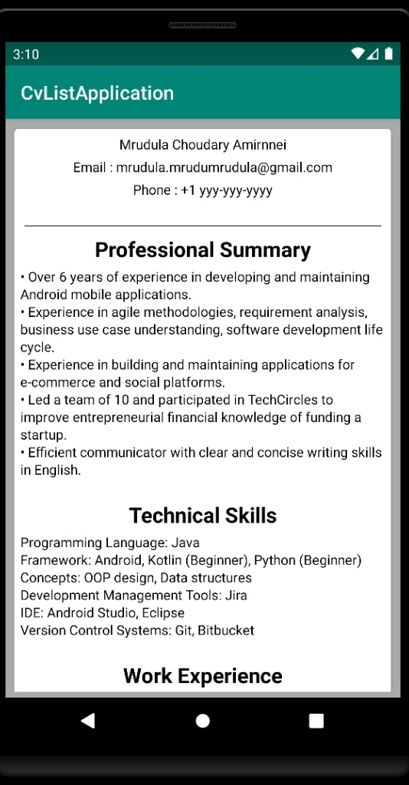
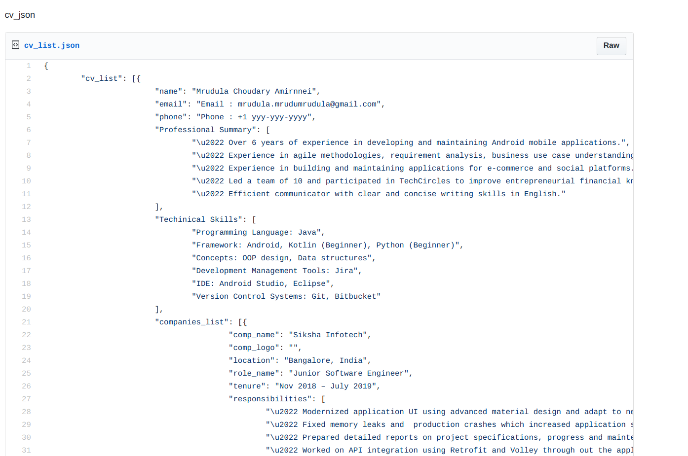

#CvListApplication

A Demo application which fetches Json stub from a public gist and renders the JSON into UI which resembles a person's CV.

In this project a piublic gist located at https://gist.github.com/mrudulamrudu/8f2fc3d93dad42892ef38d54eec4d163 is used as a data source.

 Retrofit is used as a networking library to fetch the data from gist and load it into model class

 Simple unit test cases are done on core logic classes using Roboelectric and mockito.

